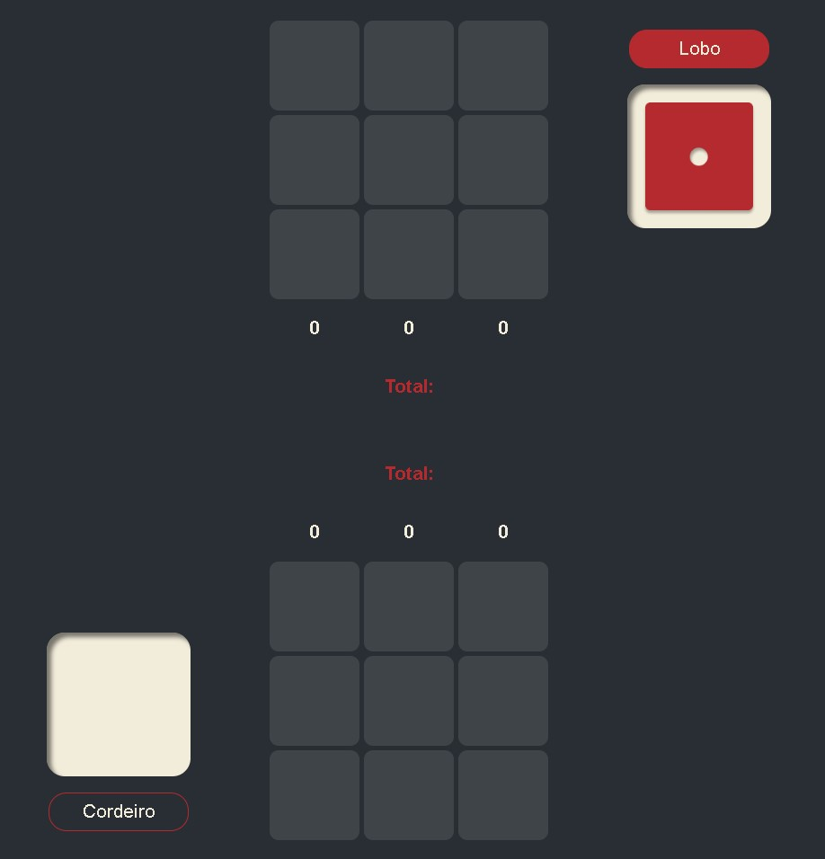

# Bugalhas 🎲🐺🐑

Um jogo de estratégia inspirado no minigame **Knucklebones** de _Cult of the Lamb_, desenvolvido com **HTML**, **CSS** e **JavaScript**.

## 🎮 Funcionalidades Principais

- **Escolha de Personagem:** Opção de jogar como **Lobo** ou **Cordeiro**.
- **Sistema de Turnos:** Cada jogador rola o dado e escolhe onde posicioná-lo.
- **Pontuação Dinâmica:** A pontuação depende do valor e da repetição dos dados na coluna.
- **Regras Estratégicas:** Combinações de dados com valores iguais aumentam a pontuação; dados iguais do adversário são destruídos.
- **Design Responsivo:** Interface adaptada para dispositivos móveis.
- **Fim de Jogo e Resultado:** Exibe automaticamente o vencedor ao término do jogo.

## 🛠 Tecnologias Utilizadas

- **HTML5:** Estrutura do jogo e telas (início, meio, fim).
- **CSS3:** Estilização visual e responsividade.
- **JavaScript (Vanilla):** Lógica do jogo, regras, pontuação e alternância de turnos.

## 📁 Estrutura do Projeto

/
├── index.html
├── estilo.css
├── responsivo.css
├── script.js
└── /dados
├── 1.png
├── 2.png
├── 3.png
├── 4.png
├── 5.png
└── 6.png

## 🧠 Regras do Jogo

- A cada turno, um dado é rolado.
- O jogador escolhe uma coluna para posicionar o dado.
- Se o valor for repetido na mesma coluna, a pontuação aumenta:
  - 2 dados iguais: fundo dourado.
  - 3 dados iguais: fundo azul.
- Se o adversário tiver dados do mesmo valor na mesma coluna, eles são destruídos.
- O jogo termina quando um dos tabuleiros estiver completamente preenchido.
- Ganha quem tiver a maior pontuação total.

## 📱 Responsividade

- Em telas menores, o design se ajusta:
  - Apenas o dado central é exibido.
  - Informações essenciais aparecem em destaque.
  - Layout otimizado para jogabilidade mobile.

## 🚀 Como Jogar

2. Clique no link: https://bugalhas-naiumis-projects.vercel.app/
3. Escolha seu lado: **Lobo** ou **Cordeiro**.
4. Role o dado e selecione uma coluna.
5. Acompanhe a pontuação.
6. Use estratégia para eliminar dados do adversário.
7. Vença com a maior pontuação ao final da partida!

## 🐑🐺 Créditos

Jogo inspirado no minigame **Knucklebones** do jogo _Cult of the Lamb_, desenvolvido de forma independente para fins educacionais e de prática em desenvolvimento web.

## Autor:

Naiumi Paiva
